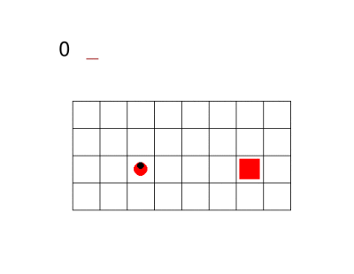
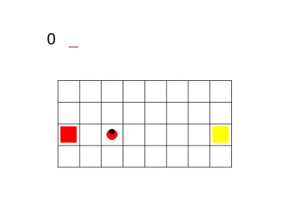
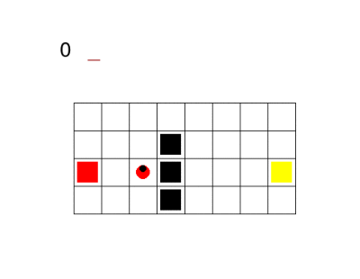
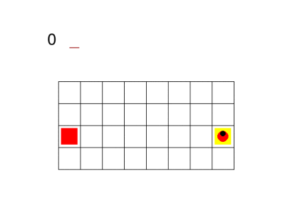

# Policy Networks for Non-Markovian Reinforcement Learning Rewards

## Authors

- ANTONELLA ANGRISANI (angrisani.1703081@studenti.uniroma1.it)
- ANDREA FANTI (fanti.1650746@studenti.uniroma1.it)
- LUCA LOBEFARO (lobefaro.1890195@studenti.uniroma1.it)

## Introduction

A possible technique to produce an agent that can achieve temporal goals specified through 𝐿𝑇𝐿𝑓/𝐿𝐷𝐿𝑓 formulas is to use Reinforcement Learning (RL). However, the theoretical framework of most RL algorithms expects that the task can be modeled with a Markov Decision Process (MDP), a key assumption of which is that the next state and reward at each step only depend on the current state–action pair. This is clearly not true in general for temporal goals. Here we adopt the approach for environments in which only the reward is non–Markovian producing an extended MDP. More specifically, a very convenient way to integrate a temporal goal in an MDP is to compute a DFA from the temporal formula for the non–Markovian goal, and then augment the original MDP state with the state of this automaton. In practice, however, simply appending the automaton state to the environment observation which is fed to the agent can be problematic. The most obvious method to overcome this is to have a collection of separate "expert" networks,one for each automaton state, which are still fed the original environment observation, and are selected based on the current state of the automaton. Here we compared this baseline approach with sharing all non–output layers of the expert networks, by using the Advantage Actor Critic (A2C) algorithm on the SapientinoCase environment. 

## Environment: SapientinoCase

In this environment we have a planar unicycle robot whose goal is to visit the colored cells of a continuous 2D grid in a specific order. This environment has a low–dimensional observation space, which allows to use simple Feed–Forward Neural Networks; moreover, since the task depends on a continuous 2D grid map, it allows to fine–tune the difficulty of the task as needed. In fact, we also compared results obtained by initializing the weights of the expert networks for harder maps by using weights previously trained on a simpler map (still exposing a non–Markovian reward).

In the gif below are shown some examples of the environment. First we have a one color setting: 

Then, different configurations with two colors are shown, in which the agent has to visit the red and yellow cells in sequence:

## Setup

Tested on Ubuntu 20.04 and Mac OS 10.15.7 with python 3.8.5

* Install environment (forked from https://github.com/cipollone/gym-sapientino-case.git):

`git clone https://github.com/andreafanti/gym-sapientino-case.git`

`cd gym-sapientino-case`

`pip install .`

* Install dependencies:

`pip install pytorch==1.7.1`

`pip install gym==0.17.3`

`pip install matplotlib==3.4.2`

* System dependencies:

ImageMagick (https://imagemagick.org/index.php)

## References
- Ronen I. Brafman, Giuseppe De Giacomo, and Fabio Patrizi. 2018.𝐿𝑇𝐿𝑓/𝐿𝐷𝐿𝑓Non-Markovian Rewards.32nd AAAIConference on Artificial Intelligence, AAAI 2018(2018), 1771–1778.   http://www.diag.uniroma1.it/degiacom/papers/2018/aaai18bdp.pdf
- Vincent François-Lavet, Peter Henderson, Riashat Islam, Marc G. Bellemare, and Joelle Pineau. 2018. An Introductionto Deep Reinforcement Learning.Foundations and Trends®in Machine Learning11, 3-4 (2018), 219–354.https://doi.org/10.1561/2200000071
- Giuseppe De Giacomo, L. Iocchi, Marco Favorito, and F. Patrizi. 2019. Foundations for Restraining Bolts: ReinforcementLearning with LTLf/LDLf Restraining Specifications. InICAPS.
- Richard S. Sutton and Andrew G. Barto. 2018.Reinforcement Learning: An Introduction(second ed.).  The MIT Press.http://incompleteideas.net/book/the-book-2nd.html

